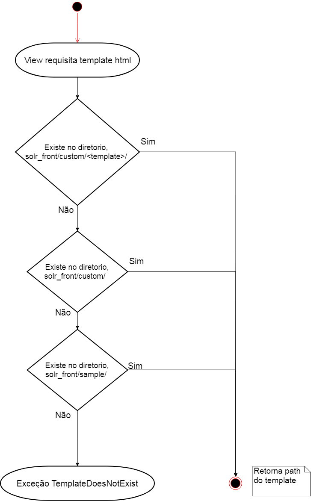

# Configuração
## Estrutura do Grafo e das collections
A estrutura de dados do buscador é um grafo, e a mesma é configurada em um arquivo formato JSON <solr_front_conf.json>.
O grafo é um conjunto de collections e cada collection também é configurada em um arquivo JSON. O arquivo de configuração tem o nome da collection mais a extenssão json. Por exemplo <nome_da_collection>.json. Os arquivos de configuração das collections ficam na pasta collection na mesma hierarquia que o arquivo de configuração da estrutura do buscador <solr_front_cont.json>.
Quando o app solr_front é inicializado (init.py), o mesmo procura pelos arquivos de configuração em um diretório. Existem três maneiras de configurar onde esses arquivos ficam armazenados:

1. settings.py
A primeira delas é configura a variável SORL_FRONT_CONFIG_PATH no settings.py do projeto Django.

2. Pasta /solr_front/conf/custom/
Caso não exista a configuração acima, o sistema procurará os arquivos nessa pasta. Pode-se fazer um link simbólico dessa pasta para uma determinada pasta no files system, porém esse link é sobrescrito toda vez que a aplicação for atualizada.

3. Pasta /solr_front/conf/sample/
Caso nenhuma das duas tentativas acima funcione, o buscador irá utilizar a configuração default que vem no sistema.

## Arquivos
* solr_front_conf.json
Este arquivo lista as collections que serão utilizado no Buscador. A estrutura que relaciona as collections é um Grafo.
* <collection>.py
Este arquivo tem todas as configurações de cada collection, como por exemplo mas não só:
Lista de Facets
Configurações dos gráficos apresentados
Configuração de títulos, labels, etc.

## Django
### Urls
É necessário a configuração da url que aponta para o buscador no projeto Django, obrigatório a definição do parâmetro ‘template’ nesta url.

Exemplo:

  ```(r'^/solr_front/(?P<template>\w+)/', include(solr_front_urls)),```

### Templates
O sistema de localização dos templates do buscador funciona de maneira parecida que a localização dos arquivos de configuração. Porém não há configurações no settings.py. Os templates são localizados na pasta templates do app solr_front.

1. Pasta /solr_front/templates/solr_front/custom/
O sistema procurará a pasta passada no parâmetro de url ‘template’ os templates, caso não encontrar a pasta ele irá buscar os arquivos na raiz da pasta custom. Pode-se fazer um link simbólico dessa pasta para uma determinada pasta no files system. Esse link não deverá ser sobrescrito porque está no .gitignore, mas caso seja removido basta recriar o apontamento para a pasta desejada.

2. Pasta /solr_front/templates/solr_front/sample/
Caso a tentativa acima não funcione, o buscador irá utilizar os templates default que vem no sistema.





** Diagrama de atividades do carregamento dos templates **


### Arquivos
Listar os arquivos de template

## settings.py
### INSTALLED_APPS
Incluir o app “solr_front”

### TEMPLATE_CONTEXT_PROCESSORS
Incluir os dois processadores de contexto do buscador:
   * 'solr_front.context_processors.get_navigate_fields'
   * 'solr_front.context_processors.navigation_tree'

## Logging
O app Django solr_front usa o mecanismo padrão de log do Django.

A aplicação utiliza a handler “solr_front”. Caso você tenha uma infraestrutura de log, simplesmente adicione o handler que todos os eventos “logáveis”, erros etc serão logados.
