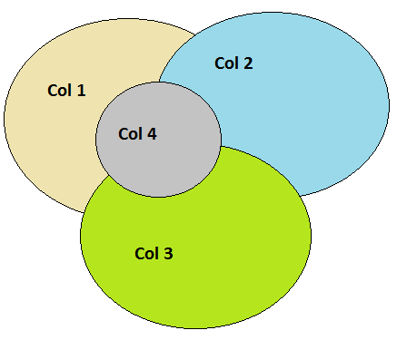
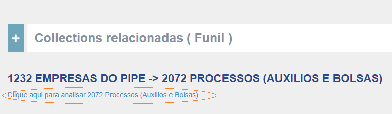
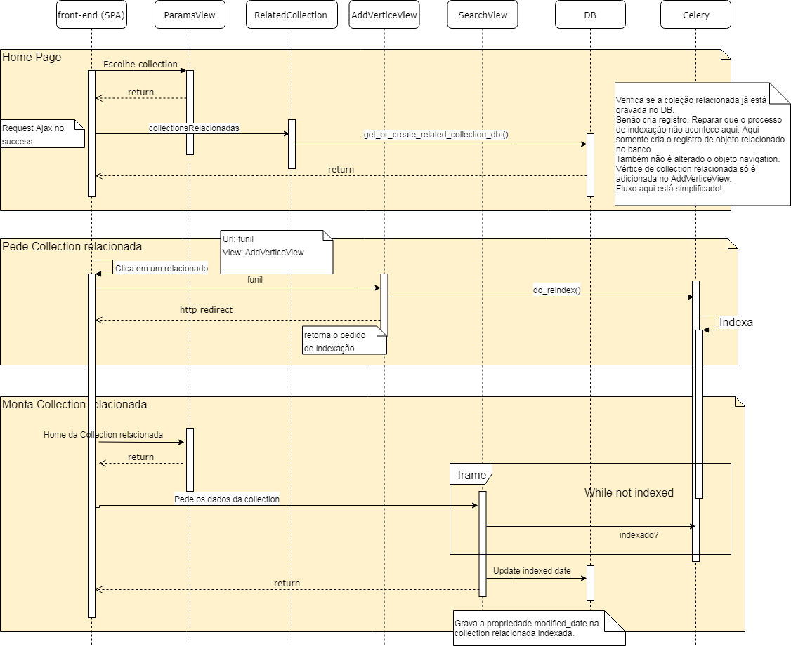

# Collections relacionadas
A estrutura de Grafo do buscador permite que collections sejam relacionadas através de campos com valores comuns. Desta maneira elas podem ser trabalhandas em conjunto no sistema.
conf.py
As collections se relacionam através de campos determinados no dicionário  EDGES do arquivo

## conf.py.

Tomo como exemplo abaixo que Col4 é um subconjunto de Col 1.

Para implementar o uso das collections relacionadas no sistema, dois processos principais foram estabelecidos e serão descritos abaixo, sendo eles a “Contabilização da quantidade dos objetos relacionas” e o processo de apresentação de “Sub-collections”.

## Contabilização da quantidade dos objetos relacionados
Este processo de contabilização existe para apresentar o “join” das collections relacionadas, como no exemplo abaixo:

Quando a página de uma collection do buscador é carregada, um Ajax chama a view RelatedCollection que recupera todas as collections relacionadas a collection em questão, para montar a apresentação conforme indicado acima.

### views.py
A view utilizada neste processo é a RelatedCollections, que faz as verificações dos relacionamentos citados acima, e a função get_or_create_related_collection_db é quem efetivamente contabiliza, e armazena as informações de contabilização.
As quantidades de cada relacionamento são “cacheadas” em banco de dados para que o processo de contabilização das quantidades dos relacionamentos não precise ser executado sempre.

## Sub-collection
A quantidade dos registros que fazerm parte de um relacionamento entre duas collections é apresentada no exemplo da figura abaixo, conforme já explicado anterioremente.

O link abaixo direciona para o subconjunto da collection B que faz interseção com a Collection A.

Para que seja possível acessar o subconjunto da collection B que faz intersecção com a collection A, é necessário indexar os registros da collection B com um marcador dessa intersecção. O subconjunto da collection B é o que chamamos de sub-collection.

Portanto ao clicar no link acima, a view AddVerticeView é acessada para cuidar do processo de reinidexação.

